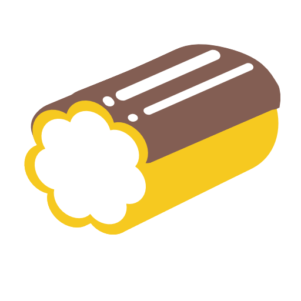

# eclair



_Embedded Cross-platform Library for Assistive Interface Routing_

Eclair is a small library for enabling Blind and Low-Vision support in
applications and game engines. It provides a simple API to send text to Screen
Readers and Synthesizers, turning that text into audible speech. It is specifically
designed to be small, simple, and embeddable into games and game engines.

Eclair supports all major desktop and mobile platforms, as well as web applications.
* macOS and iOS with VoiceOver and AVSpeech
* Windows with NVDA, JAWS, Narrator, and SAPI
* Linux with Orca and Speech Dispatcher
* Android with AccessibilityManager (TalkBack) and TextToSpeech
* Web with ariaNotify and Web Speech API

Some braille support does exist for screen readers that support them.

## Example

```c
eclair_init()
eclair_speak("Press Start to begin", true)
```

Eclair only sends text - developers are responsible for giving clear information
to users on what is being shown, what kind of control they are currently selecting,
and what options they have.

Eclair is well suited for non-standard applications and interfaces that don't
mimic standard buttons or controls. If you are using more standard application
interfaces, you may want to look at [AccessKit](https://accesskit.dev/) instead.

## API

```c
// lifecycle functions
eclair_error eclair_init(void);
void eclair_shutdown(void);

// output function
eclair_error eclair_speak(const char *utf8, bool interrupt)
eclair_error eclair_stop(void)

// settings and introspection
void eclair_set_route(eclair_route route)
void eclair_set_rate(float rate)
void eclair_set_volume(float volume)
eclair_output eclair_current_output(void)
```

## Examples

You can run the examples in the `/examples` directory of this project to test the different controls and behaviors on different platforms. You'll need to install and enable screen readers for any platform that you are testing on.

## Inspirations and Alternatives

Eclair is heavily inspired by [SRAL (now archived)](https://github.com/m1maker/SRAL) and [Prism](https://github.com/ethindp/prism).

## Logo

The above logo at the top was created by Jesse Jurman and Eva Jurman
